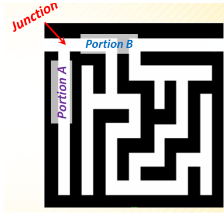

# Backtracking
- Backtracking is a technique used to solve problems with a large search space, by systematically trying and eliminating possibilities
- A standard example of backtracking would be going through a maze
  - At some point in a maze, you might have two options of which direction to go:
  - 
- One strategy would be to try going through portion A of the maze
  - If you get stuck before you find your way out, then you "backtrack" to the junction
- At this point in time you know that portion A will NOT lead you out of the maze
  - So you then start searching in Portion B

So Clearlyyy
- At a single junction you could have even more than 2 choices
- The backtracking stategy says to try each choice, one after the other
  - If you ever get stuck, "backtrack" to the junction and try the next choice
- If you try all choices and never found a way out, then there is no solution to the maze
- Well now, can you think how can you represent a maze in your program?
  - How can you create obstacles in the path
  
### Testing it out, Rat in a Maze 
- A maze is given as N*N binary matrix of blocks where,
  - The source block well be at the top left maze[0][0]
  - And destination block is lower right most block i.e., maze [N-1][N-1]
- A rat starts from source and has to reach the destination. The rat can move only in two directions:
  - Forward and down
- In the maze matrix,
  - 0 means the block is a dead end
  - And 1 means the block can be used in the path from source to destination
- Node that this is a simple version of the typical Maze problem.


### Rat in a maze
- Following is an example of maze
- Gray block are dead ends (value=0)
- White blocks are accessible (value=1)
- So the matrix representation of this maze is like this:
  ```
  M[4][4]=
  {{1,0,0,1},
   {1,1,0,0},
   {0,1,1,1},
   {1,1,0,1}
  };
  ```
- Following is a maze with highlighted solution path
- The output solution matrix should be:
  ```
  {1,0,0,0},
  {1,1,0,0},
  {0,1,1,1},
  {0,0,0,1}
  ```
- All entries in solution path are marked as 1
- Naive Algorithm
  - The naive algorithm is to generate all paths from source to destination and one by one check if the generated satsfies the constraints 
  ```
  while there are untried paths{
    generate the next path
    if this path has all blocks as 1{
        print this path;
    }
  }
  ```
#### Walking through matrix
- Movement using the array will be like:
  - Right: Maze[i][j+1]
  - Left: Maze[i][j-1]
  - Down: Maze[i+1][j]
  - Up: Maze[i-1][j] (bc ur going up to 0)
- You should check for if youre going out the matric or not

Backtracking Algorithm
```
If destination is reached 
    print the solution matric
Else
    a) Mark current cell in solution matrix as 1
    b) Move forward in the horizontal direction and recursively check if this move leads to a solution
    c) If the move chosen in the above step doesnt lead to a solution then move down and check if this move leads to a solution
    d) If none of the above solutions work then unmark this cell as 0 (backtrack) and return false
```

# Implementation
- The main, solve maze, and print functions

```
/* C program to solve Rat in a Maze problem using
backtracking */
#include <stdio.h>

// Maze size
#define N 4

int solveMazeUtil(int maze[N][N], int x, int y, int sol[N][N]);

/* A utility function to print solution matrix sol[N][N] */
void printSolution(int sol[N][N])
{
	for (int i = 0; i < N; i++) {
		for (int j = 0; j < N; j++)
			printf(" %d ", sol[i][j]);
		printf("\n");
	}
}

/* A utility function to check if x, y is valid index for N*N maze */
int isSafe(int maze[N][N], int x, int y)
{
	// if (x, y outside maze) return false
	if (x >= 0 && x < N && y >= 0 && y < N && maze[x][y] == 1)
		return 1;

	return 0;
}

/* This function solves the Maze problem using Backtracking. It mainly
uses solveMazeUtil() to solve the problem. It returns false if no
path is possible, otherwise return true and prints the path in the
form of 1s. Please note that there may be more than one solutions,
this function prints one of the feasible solutions.*/
int solveMaze(int maze[N][N])
{
	int sol[N][N] = { { 0, 0, 0, 0 },
					{ 0, 0, 0, 0 },
					{ 0, 0, 0, 0 },
					{ 0, 0, 0, 0 } };

	if (solveMazeUtil(maze, 0, 0, sol) == 0) {
		printf("Solution doesn't exist");
		return 0;
	}

	printSolution(sol);
	return 1;
}

/* A recursive utility function to solve Maze problem */
int solveMazeUtil(int maze[N][N], int x, int y, int sol[N][N])
{
	// if (x, y is goal) return true
	if (x == N - 1 && y == N - 1) {
		sol[x][y] = 1;
		return 1;
	}

	// Check if maze[x][y] is valid
	if (isSafe(maze, x, y) == 1) {
		// mark x, y as part of solution path
		sol[x][y] = 1;

       // printf("before x s(%d, %d) mat = %d\n", x+1, y, sol[x][y]);
		/* Move forward in x direction (go down / next row) */
		if (solveMazeUtil(maze, x + 1, y, sol) == 1)
			return 1;
      //  printf("before y s(%d, %d) mat = %d\n", x, y+1, sol[x][y]);
		/* If moving in x direction doesn't give solution then
		Move down in y direction */
		if (solveMazeUtil(maze, x, y + 1, sol) == 1)
			return 1;


		/* If none of the above movements work then BACKTRACK:
			unmark x, y as part of solution path */
		sol[x][y] = 0;
		//printf("after x,y s(%d, %d) mat = %d\n", x, y, sol[x][y]);
		return 0;
	}

	return 0;
}

// driver program to test above function
int main()
{
	int maze[N][N] = { { 1, 0, 0, 1 },
					   { 1, 1, 0, 0 },
					   { 0, 1, 1, 1 },
					   { 1, 1, 0, 1 }
                    };

	solveMaze(maze);
	return 0;
}


```