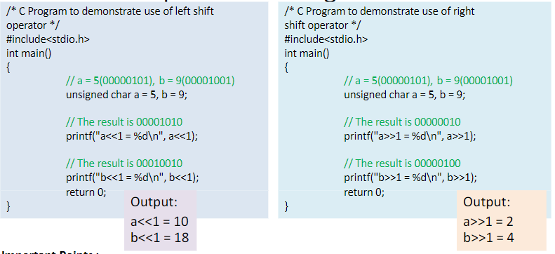
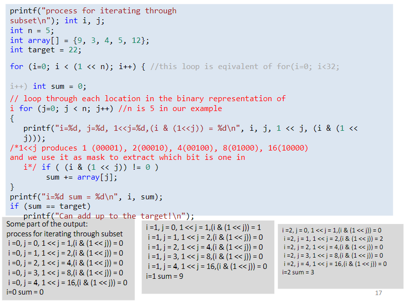

# Bitwise Operators

- We commonly use && and || for AND and OR 
- If you store numbers in binary and combine them youll get a new number ofc
  - 47 has its last 8 digits as 00101111 
  - 72 is 01001000
- Bitwise operators would take each corresponding bit in the two input numbers and calculate the output of the same opperation on each set of bits
- Bitwise AND will be represented by &
- This operation is carried out by taking the AND of two bits. If BOTH bits are ONE, the answer is one. Otherwise, the answer is 0
  -  00101111
  - <u>&01001000</u>
  - 00001000 (which has a value of 8) 
  
Example:
    - int x = 46, y=72;
    - int z = x & y
    - printf("%d",z)
    - = 8
- Heres how each function
  
AND : & : 1&1=1,rest=0
OR  : | : 0|0=0,test=1
XOR : ^ : 1^0 =0^1=0 and  0^0 =1^1=0
Not(unary operator) : ~ : ~0=1, ~1=0


### Bit masking
- **Masking** means to keep/change/remove a desired part of information
- This example shows masking on anything that isnt skin
- 
- Masking is the act of applying a mask to a value. This is accomplished by doing:
  - Bitwise ANDing in order to extract a subset of the bits in the value
  - Bitwise ORing in order to set a subset of the bits in the value
  - Bitwise XORing in order to toggle a subset of the bits in the value
- Lets say you got a 8 bit number: 00110010
  - Yo want to set (set means assiging bit 1) the least significant bit to 1
    - You could OR 0000001 to this number. So all other bits are same, just the LSB (least significant bit, the right most bit) changed to 1 
- Below is an example of extracting a subset of the bits in the value:
- Applying the mask to the value means that we want to clear the first (higher) 4 bits, and keep the last (lower) 4 bits. Thus we have extracted the lower 4 bits. The result will be:
  - Mask:  00001111b
  - Value: 01010101b
  - Result:00000101b
    - It literally erases the values from the first 4 digits

- This function tells if an integer is odd/even. We can achieve the same result with more efficiency using bit-mask-
  ```
  bool isOdd(int i){
    return i&1:
  }
  ```
    - If the LSB of a binary number is 1 then it is odd; for 0 it will be even. So, by doing AND with 1 we are removing all other bitx except for the least significant bit i.e:
      - 
      - Also, an even number will end in 0 in binary and 1 if its odd

### Twos complement
- Theres 2^3=8 amount of different numbers you can use that have 3 bits
- All of these numbers are positive so how can we use negative numbers?
- The left most bit is used for sign (0=+ and 1=-)
- In that case we lose one bit and we have remaining 2 bits to generate the actual numbers and left bit for +/-
- Now you can generate only 2^2=4 numbers in positive side and 4 numbers in negative sides
  - Kind of -2^2 to (2^2-1)

- But how do we get to the equivelant binary representation
- Twos complement is used to store regular ints
- In computer, integers are stored as 32 bits
- For simplicity of discussion, let us continue our discussion with 3 bits
- If you know the orignal positive number, Twos compliements can help you to know the equivalent negative number
- Heres the steps:
  1. Flip the bits (0 to 1 and 1 to 0)
  2. Add One (binary addition)d
- For example:
  - Consider 001 (which is 1)
  - Flipping it would result in 110
  - Adding 1 with 110 = 111
  - So 111 is -1
- Binary Addition:
  - 0+0=0
  - 1+0=1
  - 0+1=1
  - 1+1=0 (with carry 1)


Taking into account twos:
- Remember ints take 32 bits so -1 is actually
  - 11111111 11111111 11111111 11111111
  - Which is -1
  - The reason why is by taking the index of where that 1 is at and using this formula 2^(index)^
  - So if you take the last 3 numbers 111 its going to equal 7
  - But the last 4 will equal -1 because -2^3^+2^2^+2^1^+2^0^
- Taking this into account, calculating ~x=47 will be 
  - 00000000 00000000 00000000 00101111
  - Flipping them gives us:
  - 11111111 11111111 11111111 11010000
- Using a bit of logic we can see that if we were to have to have all 1s the value would be -1. But now that you flipped it, the value is -48
- In essence we can see that in the typical case, when x is positive ~x is equal to -x-1

### Left and right shift operators
- Left shift operator is **<<**
- Right shift operator is **>>**
- When we left shift a value we must specify how many bits to left shift it
  - A left shit moves each bit in the number to the left a certain number of places
  - In essense, so long as there is no overflow, a left shift of one bit multiplies  number by two 
- For example, consider 8 bits representation of 3:
  - 00000011 left shift one bit would result in 00000110 which is 6
- It follows that a left shift of 2 bits multiplies a number by 4 and a left shift of 3 bits multiplies a number by 8. In general a left shift of k bits multiplies a number by 2^k^

Example Left Shift Right Shift in C 
  - 
  - So you multiply by 2^k
  - 5<<1=10; 9<<1=18
  - 5>>1=2 ; 9>>1=4
Important Points:
- The left shift and right shift operators should not be used for negative numbers. The result of is undefined behavior of any of the operands is a negative number. For example results of both -1<<1 and 1<<-1 is undefined
- If the number is shifted more than the size of integer, the behavior is undefined. For example 1<<33 is undefined if integers are stored using 32 bits
- The left shit by 1 and right shift by 1 are equivalent to multiplication and division by 2 respectively

##### Using bitwise operators to iterate through subsets 
- Imagine solving the following with brute force:
- Given an array of value such as {9,3,4,5,12}, does there exist a subset of values in the array that adds up to a target say 22?
- Our goal would be simply to try EACH possible subset of the array, add the values and see if we get the target
- We have 5 elements in the array (index 0,1,2,3,4). If we think we think about binary and look at the binary values from 0 to 31, we have:
  - 
  - If we assume that 0 means "dont include this number in the set" and 1 means "put this number in the set" , then these 32 listings represent all possible subsets of a set of 5 values
Thus our idea is as follows:
- Loop from 0 to 31 for each value and calculate the sum of the corresponding subset
- Example, since 13 is 01101, this means that the subset we want to add up is array[3], array [2], and array[0]
- We are using the MSB in the number to correspond to the last array slot and the least significant bit in the number to correspond to index 0 in the array
- In this example, when we are considering 13, the values we add are 9,4, and 5 to obtain 18.
  
Notes:
1. Remember that a left-shift of n bits multiplies by 2^n^, so the value of 1 << n for this example is 2^5^ = 32 as desired
2. The j loop is going through each array element, trying to decide whether or not to add it. The value 1 << j has only one bit set to 1, its the bit at location j.
3. If we do a bitwise AND with a number of the form 000...001000..., then our answer will either be all 0s OR it will be the number itself. Basically all the 0s cancel out the other 31 bits. The one 1 isolates that particular bit, which is exactly what we want.


- The full code is uploaded as bitwise.c code for more explanation
- The printf of the uploaded code clarifies many things
- Some part of the code shown in the next slide
 