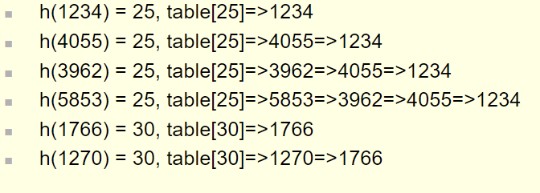

# HashTables

Table
 - An ADT that stores and retrieves records according to their search key values
  
Record:
  - Each individual row in the table
  - Example:
    - A database of student records
    - So each record will have a pid, first and last name, SSN, address, and etc

We need to be able to:
  - Add new records
  - Delete records
  - Search for records

The most effecient way of doing this?
This is it in unsorted order:
  - Running time:
    - Adding a Record:
      - O(1) since we simply add at the end of the unsorted array
    - Deleting a Record:
      - Very slow, or O(n), since we have to search through the entire array
      - We then have a "hole" in the array
      - We can quickly fill that hole by moving the last element into it, which can happen in O(1)
    - Search for a Record:
      - Very slow, or O(n)

This is it in sorted order:
  - Running time:
    - Adding a Record:
      - Must insert at correct position
      - And then ALL other records, after insertion spot, must be removed
      - O(n)
    - Deleting a Record:
      - Very slow, or O(n), since we have to search through the entire array
      - We then have a "hole" in the array
      - We can quickly fill that hole by moving the last element into it, which can happen in O(1)
    - Search for a Record:
      - Binary Search!
      - Fast or O(logn)

Truth is, even a BST is still slow

Instead use a special array called a Direct Access Table
- Assume we stored records based on SSN
- One way to do that is in a huge array
- The index into array is simply an individuals SSN
- So now you search,delete, and add based on the SSN which is very fast

This is still slow since ssn are massive and will be over 1 billion in size

This is where a hastable comes in

## Hastable
- An array of table items, where the index is calculated by a hash function
- Searching in a hash table:
  - Lets say you are searching for a record with key 4256
  - Instead of going record by record to find it use a hash function on the search key
    - This is to quickly calculate the index of the item
    - The hash function converts the key into the correct index into the table

#### Hash Function
- Mathematical calculation that maps the search key to an index in a hashtable
  - Time for calc should be O(1)
  - Should distribute items evenly
Hashing
- A way to access a table (array) in relatively constant (quick time)

A has function is written h(x)=i
**h** is the name of the has functon
**x** is the record search key
  - Such as the SSN from the previous example
**i** is the output of the hash function
  - Which refers to an index in the array
In the UCF Student example,
  h(589475127)=75127
  - This will be stored in index HasTable[75127]

#### Three simple hash functions for integers
1. Selecting digits
   - Instead of using the whole integer only select several digits
     - For example, if you have SS# 123-45-6789, just use the first 3 digits
     - h(123456789)=123
2. Folding Hash Function
   - Add the digits of the integer together
     - For example, if you have SS#123-45-6789, add all digits together
   - You can add in different ways too
     - h(123456789)=123+456+789=1368
3. Modulo arithmetic hash function
   - Using modulus as a hash function
     - h(x)=x mod tablesize
   - Using a prime number as tableSize reduces collisions
     - For tableSize=31,
     - H(123456789)=123456789 % 31 = 2

Hash functions only need to be designed to operate on integers
- Although objects such as strings can be used but they need to be converted into integer value
##### Ways to convert a string to an integer
1. Assign A to Z the numbers 0 to 25, and add the integers together
   - Ex: ABC would be 0+1+2=3
2. Use ASCII or Unicode integer value for each character, and add the integers together
   - Ex: ABC would be 65+66+67=198
3. Use the binary number for ASCII or Unicode integer value for each character, and concatenate the binary numbers together
   - Ex: ABC would be 01000001+01000010+01000011=01000001001000011=4,276,803

##### Terminology
- Perfect Hash Function
  - Ideal situation where hash function maps each search key into a different location in the hash table
    - Telephone numbers would all map to different indexes
- Collision
  - When a hash function maps two or more search keys into the same location in the hash table
    - h(key1)=h(key2)

## Collision
- Need to store the student record of ICS 211 students based on student ID
  - Student ID has 8 digits, so need array of size 100,000,000
  - This is a waste of space so instead use an array of size 31 with hash function h(x) = x mod 31 
  - h(12345678)=h(26508090)=21 is an example of a collison
  - Both should be stored at table[21]

#### Collision Resolution
- Assign the search keys with same hash function to different locations in hash table
  - Whenever possible, items should be placed evenly in the hash table in order to avoid these collisions
- Or we use another method called Bucket Hashing or Seperate Chaining
- Two main approaches to collision resolution
  - Open addressing
  - Restructure the hash table
    - Bucket hasking
    - Seperate chaining

### Open addressing
- Open addressing 
  - Probe (search) for open locations in hash table
- Probe sequence
  - The sequence of locations that are examined for a possible open located to put thhe next item
##### Three types of probing
1. Linear probing
   - In the case of a collision, keep going to the next hash table location until find an open location
     - IN other words, if table[i] is occupied, check table[i+1], table[i+2],table[i+3],...
   - Items do tend to get clustered together so its an issue
   - EX:
     - Table size=31
     - Hash function= key mod 31
       
       
2. Quadratic Probing
   - Instead of checking the next location sequentially, check the next location based on a sequence of squares
     - Inn other words, if table[i] is occupied, check table[$i+1^2$], table[$i+2^2$],table[$i+3^2$],...
     - Still have clustering (called "secordary clustering") but this method isnt not as problematic as linear probing
     - EX:
       - Table size =31
       - Hash function = key mod 31
         
3. Double hashing
   - Use two hash functions, where second hash function determines the step size to next hash table index
   - Some restrictions
     - h~2~ != h~1~ (avoids clustering)
   - Double hashing ex:
     - Table size = 31
     - Hash Function #1 = key mod 31
     - Hash Function #2 23- (key mod 23)
       
  - Unuda one
    - h1(key) = key mod 13
    - h2(key) = 11-(key mod 11)
        
### Restructuring the Hash Table
Two ways to restructure a hash table for collision resolution
1. Bucket Hashing
   - A hash table that has an array at each location table[i], so that items of the same hash index are stored here
   - Choosing the size of the bucket is problematic
     - If too small, will have collisions
     - If too bigm, will waste space
   - Ex:
     - Table size =31
     - Hash function = key mod 31
       
2. Seperate chaining
   - A hash table that has linked list at each location table[i], so that items of the same hash index are stored here
   - Size of the table is dynamic
     - Less problematic than static bucket implementation
   - Ex:
     - Table size=31
     - Hash function = key mod 31
       
  

