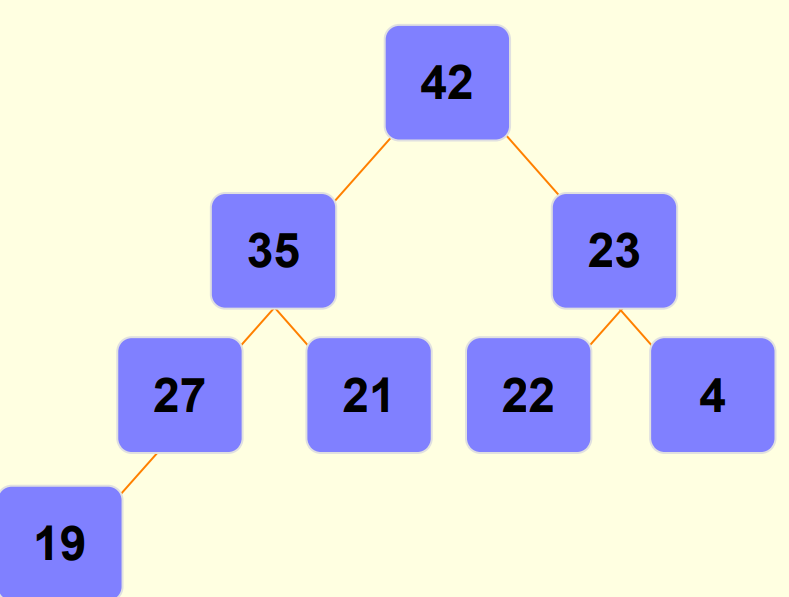

# Binary Heaps and Priority Queues

Heap:

- In a heap all values stored in the subtree of a given node must be less than or equal to the value stored in that node
- This is known as heap priority

- If B is a child of node A, then the value of node A must be greater than or equal to the balue of node B
  - This is called a Max-Heap
  - Where the root stores the highest value of any given subtree
    

- Alternatively, if all values stored in the root is less than or equal to the value stored in that in the subtrees - This is called a Min-Heap
  

There is another factor involved called the Shape Property:

-
- Heaps must be a complete binary tree
- Meaning all levels of the tree except possibly the last one, must be fully filled
- And if the last level isnt complete, the notes from the left are filled left to right

When Building a heap:

- You start left to right

    

- Each number was plugged in, in this order: 45,35,23,27,21,22,4,19

# Binary Heaps

- New nodes are always added at the lowest level
  - And are inserted from left to right
- No particular relation between the data in the nodes
  - Even if the nodes have the same parents
- Binary heaps are usually used to implement a priority queue

# Priority Heaps

- First in line doesnt mean first out
- Rather the queueing order is based on priority
  - If a data point has a higher priority than that data goes right to the front

The model:

- Requests are inserted in the order of arrival
- Request with highest priority goes first
  - Meaning its removed from queue
- Priority can be indicated by a number
  - But you have to determine what has most priority
  - Maybe your application results in smallest number having the highest priority
  - Maybe the largest number has the highest priority

How do you implement a priority queue?

- Sorted linked list
    - Higher priority items are always at the front of the list
    - Ex: A check out line in a supermarket
        - But people who are more important can cut in line wtf lmao
    - Running time:
        - O(n) insertion time: you have to search through, potentially, n nodes to find the correct spot (depends on priority)
        - O(1) deletion time (finding the node with the highest priority) since the highest priority node is the first node of the list
- Unsorted Linked List
    - Keep a list of elements as a queue
    - To add an element, append it to the end
    - To remove an element search through all the elements for the one with the highest priority
    - Running time:
        - O(1) insertion time: You simply add it to the end of the list
        - O(n) deletion time: You have to potentially search through all n nodes to find the correct node to delete

Implementation: 
=
- Best method to implement a priority queue is still a binary heap
- Running time ends of being O(log(n)) for both insertion and deleted    (cool guy) -> B)
- FindMin function ends up being O(1)
    - We just find it at the root which is O(1)

- Adding nodes to a binary heap
    - Remember
        - The binary heap must follow the shape property
            - The tree must be balanced
    - Insertions will be made in the next available spot
        - Meaning at the last level
        - And at the next spot, going from left to right
    - But most likely, if you continue to do this then the heap wont be properly maintained

- Given this binary heap provided below
- Were going to add the value 42 to the right of 27 but as you notice, its a larger value than that of 27 and 35

- If this happens Percolate upwards
    - In order to fix the out of place node, we must follow the "Percolate up" procedure
    - If the parent of the new node is less in value than the new node then you have to SWAP them
    - This counts as one percolate up step
    - Continue to do this process until the new node finds the correct spot
        - Continue SWAPPING until the parent of the new node has a greater value than the new node
        - If the new node reaches all the way up to the root then this will become the new home for the node
- Heres the process of percolating upwards:
    
    

Deleting nodes from a binary heap:
=
- We will write a function deleteMin (or deleteMax)
- We will always be deleting the root of the tree
    - DeleteMin simply deletes the root and returns its value to main

This process is for max heap
-----------
- Deleting nodes from a binary heap will leave an empty value at the root
    - To fix this heres the process:
        - Copy the last node of the tree into the position of the root
        - Then remove the last node to avoid duplicates
            - Note: The new root is most likely out of place
            - Most likely, one, or both of its children will have a greater value than it
        - Swap the new root node with the greater of its child nodes
            - This is considered one "Percolate Down" step
        - Continue this process until the node that was swapped ends up in a spot where its children have smaller values than it
    - Heres the examples:
    
    
    
    
    
    
    

- The deletion itself is O(1)
    - Cause the minimum value or maximum value is at the root
- Percolate down taks O(logn) 
    - Why?
        - Because the height of the tree is logn
        - And the worst case scenario is having to SWAP all the way to the farthest leaf
