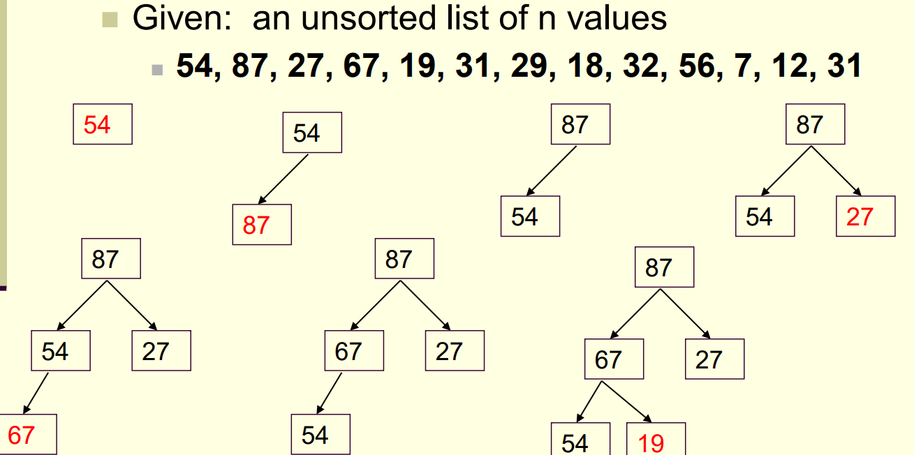
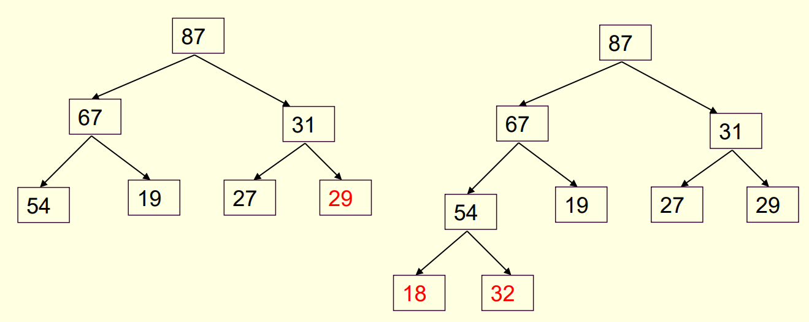
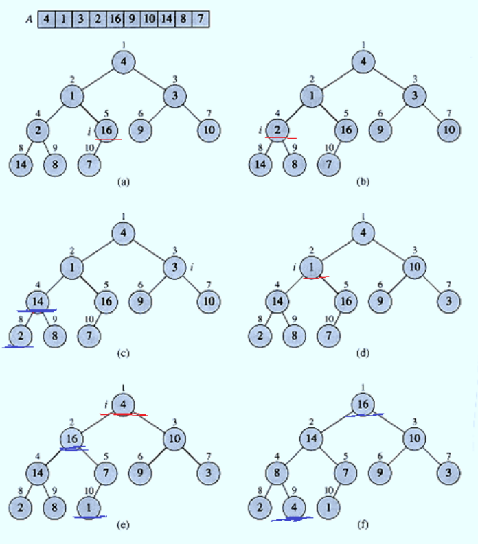
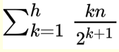

# Heap Code Implementation
Given: 54 87 27 67 19 31 29 18 32 56 7 12 31
- How can we build a heap from these values?
    - It is really just a series of "insertions"
    - Simply insert the n elements into the heap in the order that they arrive (in our case, left to right)
    - While there are more elements:
        - Insert the next element
        - Percolate up to a suitable position
    - Once we have all elements inserted, we have our heap

Skipping forward...

- The typical runtime is O(logn) but can we do better?
- Start by arbitrarily placing your elements into a complete binary tree
- Then start at the lowest level,
- Perform a percolate down (if necesary)
- So we work from the bottom and go up to the root
- Performing a percolate down at each node
    - If necessary
- This function is known as heapify

This is a good example Nico:

Building a heap from scratch
=

- Running time:
    - Note:
        - For any given complete tree, that is completely filled, the lowest level has 1/2 of the total nodes in a tree
        - A complete tree of 31 nodes, lowest level will have 16 nodes
        - And since they are already at the lowest level, no need to percolate those 16 nodes down
        - This means that the 8 nodes above it only have to percolate down once
        - And the 4 nodes above that, have to percolate down twice
    - This means that the runtime is proportional to the starting height of a node
    - Sp ~n/2 nodes that are in the leaf can be skipped together and they need to move down 0 levels (height 0)
    - ~n/4 nodes may have to be moved down 1 level (height 1)
    - ~n/8 nodes may have to be moved down 2 levels (height 2)
    - If you add them up and use shitty calculus you get this
    
- Implementation:
    - We can implement using an array
    - If the tree is complete
        - The root would be the 1st position of the arrway (index 1)
        - The two children of the node would be in index 2 and 3
        - The 4 nodes on the next level would be in index 4-7
        - The 8 nodes on the next level would be in index 8-15
        - And so on
    - ]
