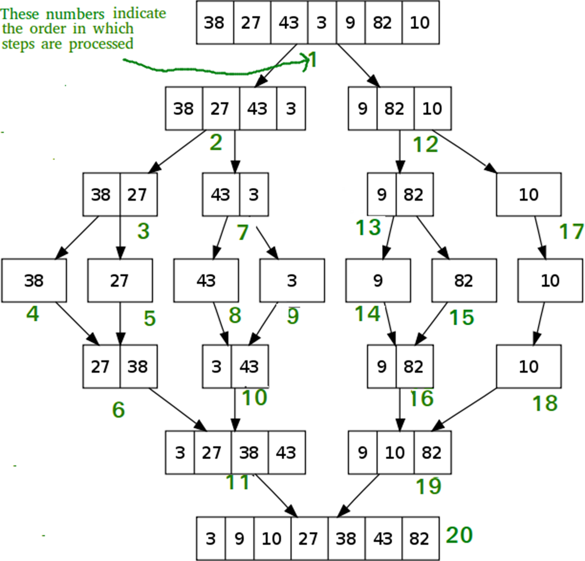
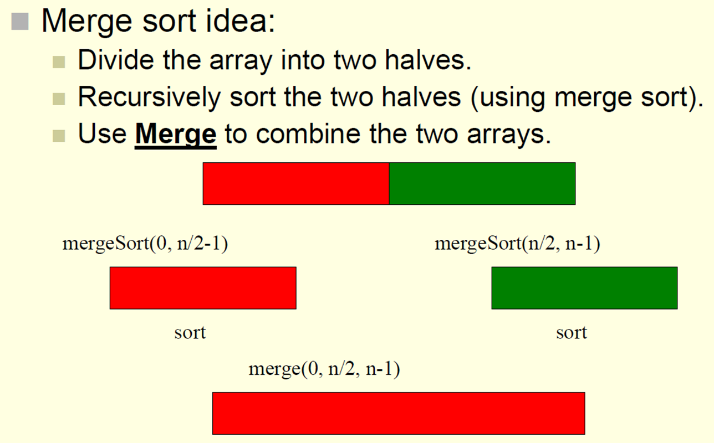
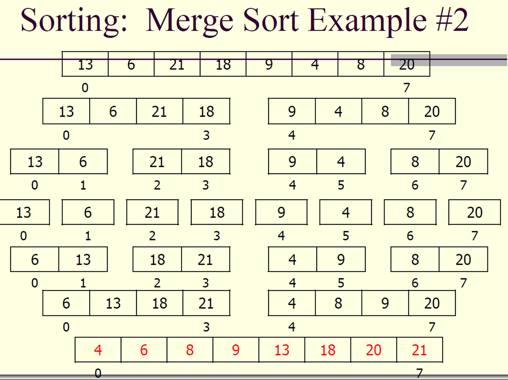

# Psuedo Code:

    
    void mergeSort(array[],left most index, right most index){

      - If the left most index is less than the right most
         - Middle = (left index + right indexs)/2
         - Call mergesort for first half, using left most and middle index
         - Call mergesort for second half, using index next to middle and right index
         - Call merge function, using left,middle, and right index
    }

    void merge(array[], left index, middle index, right index){
      - Declare your counter variables
         - Declare i which is for the left subarray
         - Declare j which is for the right subarray
         - Declare k which is for the merged subarray
      - Declare variable for the length of the left portion of the array
      - Declare variable for the length of the right potion of the array

      - Create dynamic pointer array *L for the left side of the array 
      - Create dynamic pointer array *R for the right side of the array

      - Copy data to temp arrays *L and *R
      - FOR i to the left length
         - All indexes of *L will equal all the elements within the left portion of the original arrays index
      - FOR j to the right length
         - All indexes of *R will equal all the elements within the right portion of the original arrays index
      
      //Initialize variables back to 0 
      - i is 0 which initializes index of first subarray
      - j is 0 which initializes index of second subarray
      - k is l which initializes index of merges subarray

      - WHILE i is less than length of left index and j is less than the length of right index
         - IF the left subarray is less than or equal to the right subarray
            - The merged subarray will be equal to the left subarray
            - Increase i counter
         - Else
            - Merged subarray will equal right subarray
            - Increase j counter
         - Increase k counter
      - Begin to copy any remaining elements of the left and right subarray into the merged subarray if there are any
      - WHILE counter i is less than the length of the left subarray
         - The merged subarray equals the left subarray
         - Increase both k and i counters
      - WHILE counter j is less than the length of the right subarray
         - The merged subarray equals the right subarray
         - Increase both k and i counters
      - Free both left and right subarrays

    }

# Analysis of Merge Sort:
1. Divide the array into two halves
2. Recursively Sort each half
3. Merge the two halves

- Let T(n) be the running for an input size n
- So, T(n) = (time in step 1) + (time in step 2) + (time in step 3)
- Step 1 and 2 arer sorting problems and theyre of size n/2.. since the input size gets halved
- So T(n) = T(n/2) + T(n/2) + O(n)
- T(n) = 2(T(n/2)) + O(n)
- For the time being, lets simplify O(n) to just n
- T(1) = 1

..
- T(n) = 2T(n/2) + n and T(1) = 1
- So now we have a recurrence reltaion
- Calculate T(n/2) by replacing n by n/2:
- T(n/2) = 2T(n/4) + n/2 [We subbed T(n/2)]
- So T(n) = 2T(n/4) + n = 2[2T(n/4)+n/2]+n
- T(n) = 4(T(n/4)) + 2n
- Calculate T(n/4): T(n/4) = 2T(n/8)+n/4
- T(n) = 4T(n/4) + 2n = 4[2T(n/8)+n/4]+2n
- Simplify: T(n) = 8T(n/8) + 3n
- Heres the pattern:
    =
    - T(n) = 2T(n/2)+n //1st step
    - T(n) = 4T(n/4)+2n //2nd step
    - T(n) = 8T(n/8)+3n //3rd Step
    - T(n) = 2^k*T(n/2^k)+kn //Kth recursion
- Make subsititions:
    =
    - n/2^k=1
    - n=2^k
    - k=log_2n
    - T(n)= 2^(log_2n)T(1)+(log_2n)n

Merge Sort = O(n&logn) time
=
   
