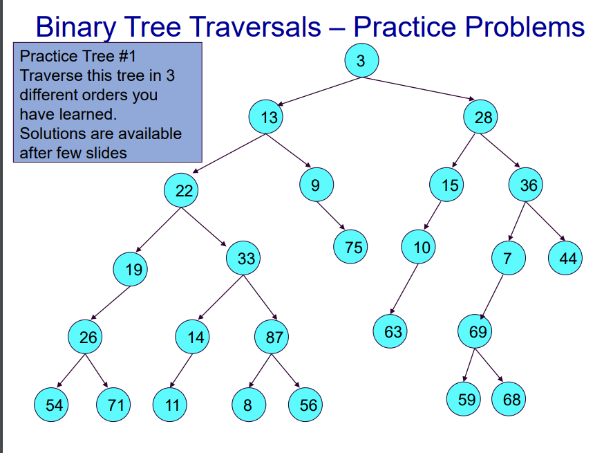

# Binary Search Trees

Structure:

    typedef struct tree_node{
        int data;
        tree_node *left_child;
        tree_node *right_child;
    }tree_node;

Tree Traversal
=

- Preorder: The root is visited before its left and right subtrees
- Inorder: The root is visited between the subtrees
- Postorder: The root is visited after both subtrees

PreOrder:
=

Code:

    void preorder(struct tree_node *p){
        if(p!=NULL){
            printf("%d ", p->data);
            preorder(p->left_child);
            preorder(p->right_child);
        }
    }

Example:
    a
   b c
Output: a b c

Output: a b d g h e i c f j

Inorder:
=

Code:

    void inorder(struct tree_node *p){
        if(p!=NULL){
            inorder(p->left_child);
            printf("%d ",p->data);
            inorder(p->right_child);
        }
    }

Example:
    a
   b c

Output: b a c

Output: g d h b e i a f j c

If a node has one node connected to it, imagine it has an invisible child and count from the left back up and down to the actual child

Postorder:
=

Code:

    void preorder(struct tree_node *p){
        if (p!=NULL){
            postorder(p->left_child);
            postorder(p->right_child);
            printf("%d ", p->data);
        }
    }

Example:
    a
   b c
Output: b c a

Output: g h d i e b j f c a

Tree Traversals:

Preorder: a b c d f g e

Inorder: b a f d g c e

Postorder: b f g d e c a

# ALWAYS START FROM LEFT

Numbers that are smaller than the root will be stored on the left
Numbers that are larger than the root will be sotred on the right

Preorder: 44 24 20 15 8 19 36 28 30 40 42 65 56 62 58 64 88

Inorder: 8 15 19 20 24 28 30 36 40 42 44 56 58 62 64 65 88

Postorder: 8 19 15 20 28 30 40 42 36 24 56 58 64 62 88 65 44

Preorder: 3 13 22 19 26 54 71 33 14 11 87 8 56 28 15 10 63 36 7 69 59 68 44

Inorder: 54 26 71 19 22 11 14 33 8 87 56 13 9 75 3 63 10 15 28 59 69 68 7 36 44 

Postorder: 54 71 26 19 11 14 8 56 87 33 22 75 9 13 63 10 15 59 68 69 7 44 36 28 3

Preorder: 3 28 36 44 7 69 68 59 13 9 75 22 33 87 56 8 14 11 19 26 71 54

Inorder: 44 36 7 68 69 59 28 15 10 63 3 75 9 13 56 87 8 33 14 11 22 19 71 26 54

Postorder: 44 68 59 69 7 36 63 10 15 28 75 9 56 8 87 11 14 33 71 54 26 19 22 13 3