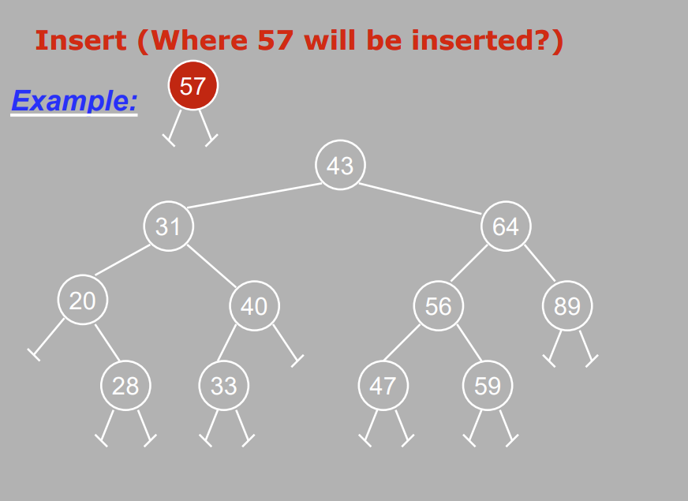

# Binary Trees: Search and Insert

Structure:

    typedef struct tree_node{
        int data;
        tree_node *left_child;
        tree_node *right_child;
    }tree_node;

Create Node function:

    tree_node *create_node(int val){

        //Allocate Space for the node
        tree_node *temp;
        temp=(tree_node*)malloc(sizeof(tree_node));

        //Initialize fields
        temp->data=val;
        temp->left=NULL;
        temp->right=NULL;

        return temp;
    }

Insertion
= 

- Now that we have the node created, we have to insert
- Smaller items to the left of any root
- Larger items to the right of any root

- When we insert, you must follow these rules:
    - Go right if the new value is greater than the root
    - Go left if the new value is less than the root

How the main function will look like:

    //main function stuff before this
    tree_node *my_root= NULL, *temp_node;
    while(some exit condition){
        printf("Enter a value to insert: );
        scanf("%d", &val);
        temp_node=create_node(val);
        my_root=insert(my_root,temp_node);

        //other code
    }

    Other code will be like:
    - Create new Node for item
    - Find a parent node
    - Attach new node as a leaf

Insertion: Recursive
- Parameters: Here is how we call the function from the main function
- If my_root is NULL, the tree is empty
    - Just return temp_node as it will be assigned to root
- Else see which subtree the node should be inserted into
    - Compare the temp_nodes data to the roots item
- Based on the comparison, it will be recursively stored in either the left or right subtree

    tree_node *insert(tree_node *root, tree_node *element){
        //Inserting into empty tree
        if(root==NULL)
            return element;
        else{

            //Element should be inserted into the right
            if(element->data>root->data){
                //There is a right subtree to insert the node
                if(root->right !=NULL)
                    root->right=insert(root->right,element);
                //Place the node directly to the right of root
                else
                    root->right=element
            }

            //Element should be inserted to the left
            else{
                //There is a left subtree to insert the node
                if(root->left !=NULL)
                    root->left=insert(root->left,element);
                //Place the node directly to the right of root
                else
                    root->left=element;
            }
            return root;
        }
    }

To test it out, print out the BST inorder to see if it sorted correctly

BST- Computing Sum of Nodes
=
- All we need to do is add values at root, left and right, and then return the answer
- Code:

    int add(tree_node *current_ptr){

        if(current_ptr!=NULL)
            return current_ptr->data + add(current_ptr->left) + add(current_ptr->right);
        else
            return 0;
    }

Searching in BST
=

- Should be easier as you know about insertion
- Steps to search for the node with the data you are looking for:

    1) If the root node is NULL return false
    ELSE
    2) Check the root node. If the value we are searching for is in the root, return 1 (representing "found")
    3) If not, if the value is less than that stored in the root node, recursively search in the left subtree
    4) Otherwise, recursively search in the right subtree
    5) Returns: 1 if found and 0 if not found

Code:

    int find(tree_node *current_ptr, int val){

        //Check if there nodes in the tree
        if(current_ptr != NULL){

            //Found value at root
            if(current_ptr->data==val)
                return 1;
            //Search to the left
            if(val<current_ptr->data)
                return find(current_ptr->left,val);
            //Search to the right
            else
                return find(current_ptr->right,val);
            
        }

        else
            return 0;
    }

How would you call the find function?

    printf("What value would you like to search for?\n");
    scanf("%d",&val);
    if(find(my_root,val))
        printf("Found %d in the tree \n",val);
    else
        printf("Did not find %d in the tree\n",val);