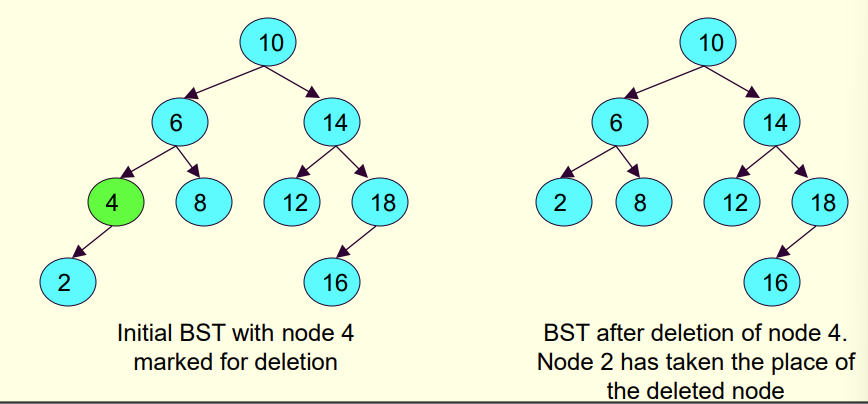
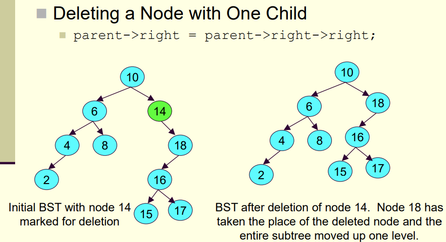
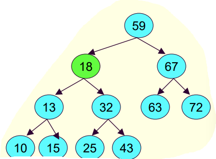
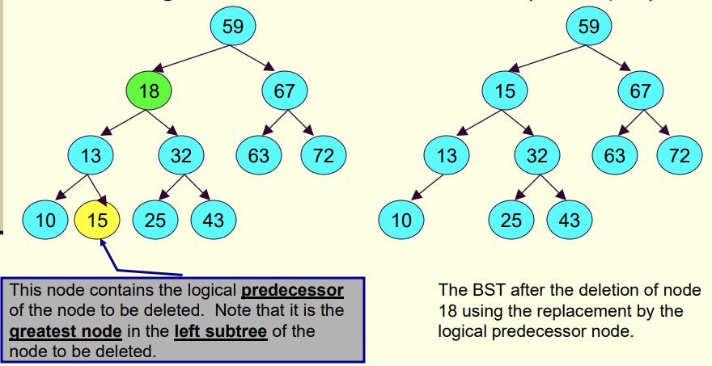

# Deletion:

- There are 3 possible case
    - Deleting of a leaf node
    - Deleting a node with one child
    - Deleting a node with two children

Deleting a leaf node:
- We start by identifying the parent of the node we wish to delete
- We then free that node accessing it via parent:
    -free(parent->left) or free(parent->right)
- We simply update the parents left or right pointer now, basically saying we murded their child, oops
- Set appropriate node to null: Parent->left=NULL or Parent->right=NULL

Deleting a Node with one child:
- We find the parent (meaning the parent of the node we want to kill)
- The parents pointer to the node is changed to now point to the deleted nodes child
- This basically lifts up the deleted nodes child
- parent->left=parent->left->left

Deleting a node with two children
- If we delete a node with two children, one of those has to replace the parents place

- If we want to kill 18 then who replaces it?
- Theres only two nodes that can:
    1) The max value of the left subtree
        - 15
    2) The minimum value of the right subtree
        - 25
- Once we choose whichever of these options we basically copy the number into 18s position
- Meaning if we copy node 15 into 18s position, we will have two 15s
- Now we just have to delete the leaf node with 15

- So when you examine the code,
- You will see many auxiliary functions used such as:

1) findNode: returns a pointer to a node in a given tree that stores a particular value

        tree_node *findNode(tree_node *current_ptr,int value){
            if(current_ptr!=NULL){

                //Found at root
                if(current_ptr->data==value)
                    return current_ptr;
                if(value<current_ptr)
                    return findNode(current_ptr->left,value);
                else
                    return findNode(current_ptr->right,value);
            }

            return NULL;
        }

2) parent: finds the parent of a given node in a given binary tree

        tree_node *parents(tree_node *root, tree_node *node){
            //If empty or if the node is the only thing in there
            if(root==NULL || root==node)
                return NULL;
            //If the root is the node you want
            if(root->left==node || root->right==node)
                return root;
            //If the node is less than the root then look at the left 
            if(node->data < root->data)
                return parents(root->left,node);
            //If the node is greater than the root then look at the right
            else if(node->data > root->data)
                return parents(root->right,node);
            return NULL;
        }

3) minVal: finds the minimum value in a given binary tree
    
    Remember this is used when deleting and is for finding the leftmost smallest value

        tree_node *minVal(tree_node *root){
            //Root stores the minimal value
            if(root->left==NULL)
                return root;
            //Left subtree search
            else
                return minVal(root->left);
        }

4) maxVal: finds the maximum value in a given binary tree

        tree_node *maxVal(tree_node *root){
            //Root stores the max value to its right
            if(root->right==NULL)
                return root;
            //Right subtree search
            else
                return maxVal(root->right);
        }

5) isLeaf: determines if a node is a leaf node or not

        tree_node *isLeaf(tree_node *node){
            return (node->left==NULL && node->right==NULL)
        }

6) hasOnlyLeftChild: Determines if a node only has a left child

        tree_node *hasOnlyLeftChild(tree_node *node){
            return (node->left!=NULL && node->right==NULL)
        }

7) hasOnlyRightChild: Determines if a node only has a right child

        tree_node *hasOnlyRightChild(tree_node *node){
            return (node->left==NULL && node->right!=NULL)
        }