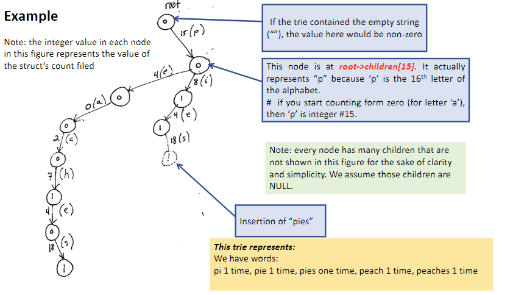
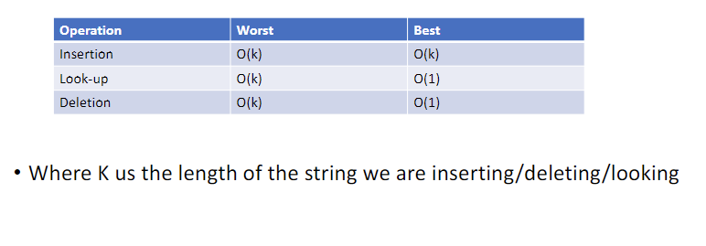
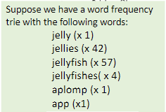

# Tries
We have binary trees with basic structure such as this
```
struct node{
    int data;
    struct node *left,*right;
};

For string:
struct node{
    char name[100];
    struct node *left,*right;
};
```

### Trie
- Trie is another data structure
- Two big characteristics:
- First:
  - A trie is a tree in which every node has 26 children (26 child pointers)
  - Some or all pointers maybe NULL out of this 26 pointers
  - We have 26 letters so 26 children
  - Each pointer is for each character (starting from 0 to 25)
    ```
    struct trienode{
        int count;
        TriNode *children[26];
    }
    ```
- Second:
  - Strings we insert into a trie are not stored as data inside our nodes
  - Instead, the string that a node represents is based on the path you take to reach that node



Runtime:


### Accessing the count of a word
- If the word "apple" has been inserted into your trie how can u access its count field
  - The letter:
  - 'a' corresponds to index 0 in the children arrays
  - 'p' corresponds to index 15
  - 'l' corresponds to index 11
  - 'e' corresponds to index 4
- So we could access that field like
`root->children[0]->children[15]->children[15]->children[11]->children[4]->count`
- What if we dont know the index of 'p' off the top of our heads though?
- p-a can actually give you the index of 'p'
- `root->children['a'-'a']->children['p'-'a']->children['p'-'a']->children['I'-'A']-?children['e'-'a']`

### Deleting strings from trie

- To delete "aplomb":
  - We can decrement the count at its terminal node to zero
  - Then delete all the nodes up to (and including) the 'i' since they have no children
- To delete one occurence of"jelly", we simply decrement the count value at its terminal node
  - We cannot delete its terminal node even though its count is now zero
- To delete one occurence of "jellyfishes" we decrement the count filled at its terminal node, but no nodes get deleted
- 