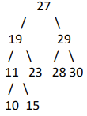

# Exam Review

11 Questions, 110 Points

- Dynamic Memory Management
- Linked Lists
- Binary Trees
- MinHeaps
- Recursion
- Tries
- Algorithm Analysis
- Recurrence Relations
- Bitwise Operators
- Avl Trees
- Backtracking

## DMM Questions

1.  Consider a binary search tree, where each node contains some key integer
    value and data in the form of a linked list of integers. The structures are
    shown below: the tree nodes and list nodes are dynamically allocated. We
    are going to eventually upgrade the structure, and when we do so, all of the
    dynamically allocated memory will be deleted (including all of the linked
    lists). Write a function called deleteTreeList that will take in the root of the
    tree, freeing all the memory space that the tree previously took up. Your
    function should take 1 parameter: a pointer to the root. It should return a
    null pointer representing the now empty tree.

```
typedef struct ListNode{
    int value;
    listNode *next;
}listNode;

typedef struct treeNode{
    int value;
    treeNode *left;
    treeNode *right;
    listNode *head;
}treeNode;

treeNode *deleteTreelist(treeNode *root){


}
```

## Linked list

1. An alternate method of storing a string is to store each letter of the string in a single node of a linked list,
with the first node of the list storing the first letter of the string. Using this method of storage, no
null character is needed since the next field of the node storing the last letter of the string would
simply be a null pointer. Write a function that takes in a pointer to a linked list storing a string and
returns a pointer to a traditional C string storing the same contents. Make sure to dynamically
allocate your string in the function and null terminate it before returning the pointer to the string.
Assume that a function, length, exists already (that you can call in your solution), that takes in a
pointer to a node and returns the length of the list it points to. The prototype for this function is
provided below after the struct definition.

```
typedef struct node{
    char letter;
    node *next;
}

char *toCString(node *head){

}

```

## Binary trees

1. Know
   - Pre-Order
   - In-order
   - Post-order

Do questions

## Minheaps

1.  Show the state of the following minheap after performing the deleteMin
    operation. (Instead of writing this with a pen or pencil, typing the result
    in text similarly to how the drawing of the heap below was constructed
    will suffice.)

                14
            22      72
          38  40  80  90

## Recursive Questions

1. Consider the problem of a frog jumping out of a well. Initially, the frog is n feet below the top of the well. When the frog jumps
   up, it elevates u feet. If a jump gets the frog to the top of the well or past it, the frog escapes the well. If not, unfortunately,
   the frog slips down by d feet before clinging to the side of the well. (Note that d < u.) Write a recursive function that takes in
   positive integers, n, u, and d, and returns the number of times the frog must jump to get out of the well. For example, if n =
   10, u = 5 and d = 3, the function should return 4. On the first jump, the frog goes from 10 feet below the top to 8 feet below
   (5-3 is the progress). On the second jump, the frog goes from 8 feet below the top to 6 feet below the top. On the third jump,
   the frog goes from 6 feet below the top to 4 feet below the top. On the last jump, since 5 feet is enough to clear the top of the
   well, the frog does not slip down and gets out. In this case, had n = 11, the frog would have also gotten out in 4 jumps. (Note:
   Although one can do some math to arrive at an O(1) solution without recursion, please use recursion to simulate the jumping
   process described as this is what is being tested - the ability to take a process and express it in code, recursively. Also, though
   this is a toy problem, it's surprisingly similar to the real life process of paying off a loan, though in the latter process, the
   amount you "slip down" slowly decreases, month after month.)

## Tries

1. Given a dictionary of words stored in a trie rooted at root, and a string, str, consider the
problem of determining the length of the longest prefix of str that is also a prefix of one of
the words stored in the trie. You may assume that if a link in the trie exists, a valid word is
stored down that path in the trie. You may use string functions as needed, but please try to
do so efficiently. (One point will be deducted forinefficient use of a particular string
function.) For example, if str = “capitulate” and the trie stored the setof words {“actor”,
“bank”, “cat”, “capitol”, and “caption”}, then the function should return 5 since, the first five
letters of “capitulate” are the same as the first five letters of “capitol”, and no other word
stored in the trie shares the first six letters with “capitulate.” Complete the code for the
function that solves this problem below. root is a pointer to the root of the trie and str is a
pointer to the string. You may assume that at least one word is stored in the trie. The
function signature and trie node struct definition are given below.
Note that due to the function signature, you must write your code iteratively.

```
#include <string.h>

typedef struct TrieNode{
    TrieNode *children[26];
    int flag;
}TrieNode;

int maxPrefixMatch(TrieNode *root, char *str){


}

```

## Algorithm analysis

1. What is the Big-Oh memory usage for the function call createNode(N)? Please provide your answer in terms of the input
   parameter, N. Please justify your answer by either evaluating an appropriate recurrence relation or summation.

```
typedef struct Node Node;
struct Node {
    Node ** children;
    int val;
};

Node * createNode(int N)
{
    Node * res = (Node *) malloc(sizeof(Node));
    if (N == 0)
        return res;
    res->children = (Node **) malloc(sizeof(Node*) * N);
    res->children[0] = createNode(N / 2);
    res->val = 0;
    for (int i = 0; i < N; i++)
        res->val += i;
    return res;
}


```

Recurrence Relations

2. Using the iteration technique, just solve for the next two iterations of the following recurrence relation:
   𝑇(𝑛) = 3𝑇(𝑛 − 1) + $𝑛^2$, 𝑓𝑜𝑟 𝑖𝑛𝑡𝑒𝑔𝑒𝑟𝑠 𝑛 > 0
   𝑇(0) = 1
   Your answers should be of the form
   𝑇(𝑛) = 𝑎𝑇(𝑛 − 2) + $𝑏𝑛^2$ − 𝑐𝑛 + 𝑑 and
   𝑇(𝑛) = 𝑒𝑇(𝑛 − 3) + $𝑓𝑛2$ − 𝑔𝑛 + ℎ, where a, b, c, d, e, f, g, and h are positive
   integers.

## Bitwise Operators

1. There are 20 light switches, numbered 0 to 19, each which control a single light. Initially, all of the lights
the switches control are off. There are several buttons. Each button toggles several switches, when
pressed. For example, if a button toggles the switches 3, 5 and 9, then pressing the button changes the
state of the three switches 3, 5 and 9, leaving the other switches in the same state. (So, if lights 3 and 5
were on and light 9 was off, after the button is pressed, lights 3 and 5 would be off and light 9 would be
on.) Each button can be stored in a single integer, where the kth bit is set to 1 if that button toggles the
kth switch and set to 0 if pressing the button doesn't affect the kth switch. For example, the button
described would be stored as the integer 552 since 2^3 + 2^5 + 2^9 = 552. Write a function that takes in
an array, buttons, storing the buttons to press and an integer len, representing the length of the array
buttons and returns a single integer storing the state of the lights after each of the buttons has been
pressed once, assuming that all of the lights were off before any of the button presses. The format for
storing the state of the lights should be identical to the format of the buttons

```
int pressButtons(int buttons[],int len){

}

```

## AVL Trees

(A) Insert the value 6 into the following AVL tree. Clearly show where the node is inserted initially and what the tree looks
like after each rotation that takes place (if any).


(B) List all the integer values that would cause a double rotation if inserted into the
following AVL tree. If there are no such values, say so. (Assume we do not allow the
insertion of duplicate values into our AVL trees.)


## BackTracking

1. Imagine a dating website that asks each user 20 yes/no questions and stores their answers
in a single
integer in between 0 and 220-1, with the answer to the kth question stored in bit 2k-1
, with 0 representing no and 1 representing yes. (So for example, if one person’s answers
to questions 1, 3 and 4 were yes and the rest of the answers were no, the integer 11012 =
13 would be used to represent her 20 answers to the questions.) Consider the problem of
finding the “best match” for a client out of a list of prospective matches. We consider a
match A for the client to be better than match B if she shares more answers on
corresponding questions with A than B. Write a function that takes in an integer
representing the client’s answers, an array of integers storing the answers of potential
matches, and the length of that array, which returns the index into the array storing the
best match for that client. If there are multiple best
matches, you may return the index associated with any of them. A function has been given
that you may call in your code, if you find it useful.

```
int bestMatch(int client,int *matches,int length){


    
}
```